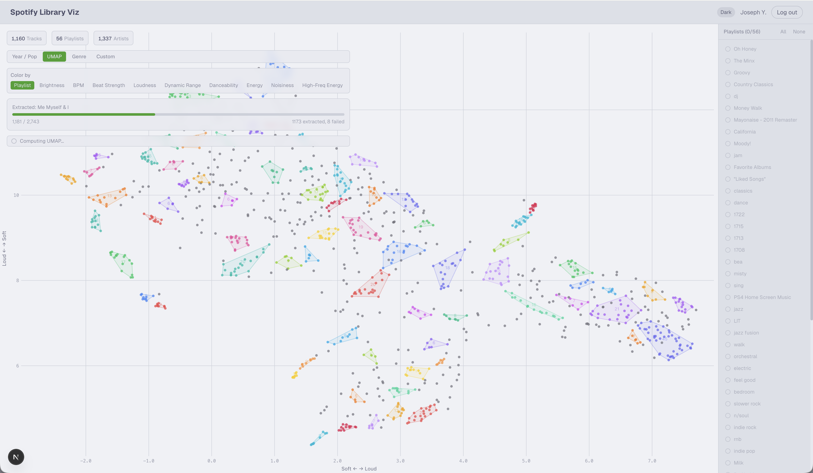

# Spotify Library Visualization

> **Note**: This project was built with [Claude Code](https://claude.ai/claude-code). Code, documentation, and commit messages were AI-generated with human direction and review.

An interactive web app that plots your entire Spotify library as a scatter plot, draws boundaries around playlist groupings, and reveals latent clusters — songs that could be playlists but aren't. Inspired by [Every Noise at Once](https://everynoise.com), but personal.



## Stack

| Layer | Technology |
|-------|-----------|
| Frontend | Next.js 16, React 19, TypeScript, Tailwind CSS 4 |
| Visualization | D3.js on Canvas (not SVG — performs well at 5000+ points) |
| Auth | Spotify OAuth 2.0 + `iron-session` encrypted cookies |
| Database | SQLite via `better-sqlite3` (WAL mode, 24h cache TTL) |
| Rate limiting | `p-queue` (concurrency 10, 25 req/sec) |
| Audio analysis | [Essentia](https://essentia.upf.edu) + Discogs-EffNet TF model (1280-dim learned musical embeddings) |
| Audio sourcing | [ytmusicapi](https://github.com/sigma67/ytmusicapi) (search) + `yt-dlp` (download) |
| ML sidecar | FastAPI + `umap-learn` + `hdbscan` + Essentia (Python 3.11) |
| Deployment | Docker Compose on Oracle Cloud VPS behind Cloudflare tunnel |

## Setup

### Prerequisites

- Node.js 20+
- `conda` / `mamba` / `micromamba` (the sidecar env is defined in `umap-service/environment.yml`; `essentia-tensorflow` is only on conda-forge + a pre-release PyPI wheel, so pip alone is brittle)
- A [Spotify Developer App](https://developer.spotify.com/dashboard) with your email added under User Management
- YouTube Music browser auth headers (for audio sourcing — see [ytmusicapi setup](https://ytmusicapi.readthedocs.io/en/stable/setup/browser.html))

### 1. Configure environment

```bash
cp .env.example .env.local
```

Fill in `SPOTIFY_CLIENT_ID`, `SPOTIFY_CLIENT_SECRET`, and generate a random `SESSION_SECRET` (32+ chars). Set the redirect URI in your Spotify app to:

```
http://127.0.0.1:3000/api/auth/callback
```

Use `127.0.0.1`, not `localhost` — Spotify rejects HTTP localhost redirect URIs.

### 2. Run in development

Create the sidecar env once:

```bash
cd umap-service
conda env create -f environment.yml  # or: mamba / micromamba
```

Then run both services:

```bash
# terminal 1 — Python sidecar
cd umap-service
conda activate spotify-project
uvicorn main:app --host 127.0.0.1 --port 8000

# terminal 2 — Next.js app
cd next-app
npm install
npm run dev
```

Open `http://127.0.0.1:3000` (not `localhost` — cookies are domain-scoped).

### 3. Run with Docker Compose

```bash
docker compose up --build
```

This starts both the Next.js app (port 3000) and the Python UMAP sidecar (port 8000, internal only). The web service waits for the UMAP health check before starting.

## Architecture

```
User  ->  Spotify OAuth login
      ->  Fetch saved tracks + playlists + artist genres  (paginated, rate-limited)
      ->  Cache in SQLite
      ->  Python sidecar: search YouTube Music  ->  download audio  ->  Essentia feature extraction
      ->  Cache features + YouTube link in SQLite (audio retained during dev, discarded in prod)
      ->  UMAP on audio features  ->  2D coordinates
      ->  D3 renders interactive scatter plot with playlist boundaries
```

### Key directories

```
next-app/src/
  app/
    api/auth/{login,callback,logout,refresh}/  -- OAuth routes
    api/library/                               -- SSE streaming data fetch
    dashboard/                                 -- scatter plot page
  components/
    ScatterPlot.tsx    -- D3 Canvas renderer (zoom, pan, quadtree hit-test)
    SongTooltip.tsx    -- hover card with album art
    PlaylistLegend.tsx -- color-coded playlist toggles
    LibraryLoader.tsx  -- SSE progress bar
  lib/
    spotify.ts  -- paginated Spotify API wrapper
    auth.ts     -- iron-session config
    db.ts       -- SQLite cache layer
    types.ts    -- shared TypeScript interfaces

umap-service/
  main.py         -- FastAPI: /umap, /cluster, /features, /health
  tf_extract.py   -- Discogs-EffNet TF embedding extraction (1280-dim)
  feature_extract.py -- Raw spectral feature extraction (41-dim)
  audio_source.py -- ytmusicapi search + yt-dlp download + SQLite cache
```

## Current state

Phases 0 through 7 are complete. Feature extraction uses Discogs-EffNet TF embeddings (1280-dim learned musical similarity) for UMAP, with raw spectral features (41-dim) retained for the "Color by" overlay. HDBSCAN cluster hulls render directly on the UMAP map (one polygon per cluster, noise points stay uncontained). The pipeline, UI, and all phases are fully functional. See [PLAN.md](PLAN.md) for details.

## Static demo export

The Next app ships a helper that snapshots the library + UMAP coords + cluster labels + raw features into JSON files for a read-only static deployment:

```bash
cd next-app
# sidecar must be running at http://127.0.0.1:8000 for cluster labels
node scripts/export-demo.mjs [outDir]
```

Default `outDir` is `../../site/public/demo/spotify` — adjust as needed. Output bundle is roughly 900 KB for a 900-track library.

## Known limitations

- **Spotify audio features unavailable**: Spotify deprecated the `/audio-features` endpoint for new apps in November 2024, and `preview_url` returns null for all tracks. Audio features are instead extracted via YouTube Music (search with ytmusicapi → download with yt-dlp → analyze with Essentia). Audio files are retained during development (in `umap-service/data/audio/`) to avoid re-downloading during extraction pivots; production should delete after processing.
- **YouTube Music browser auth expires**: The ytmusicapi browser auth cookies need periodic re-authentication.
- **TF embeddings require re-extraction**: Existing tracks with only raw spectral features need re-download for Discogs-EffNet TF embedding extraction (YouTube links are cached, so search is skipped).

## License

[GPL-3.0](LICENSE)
